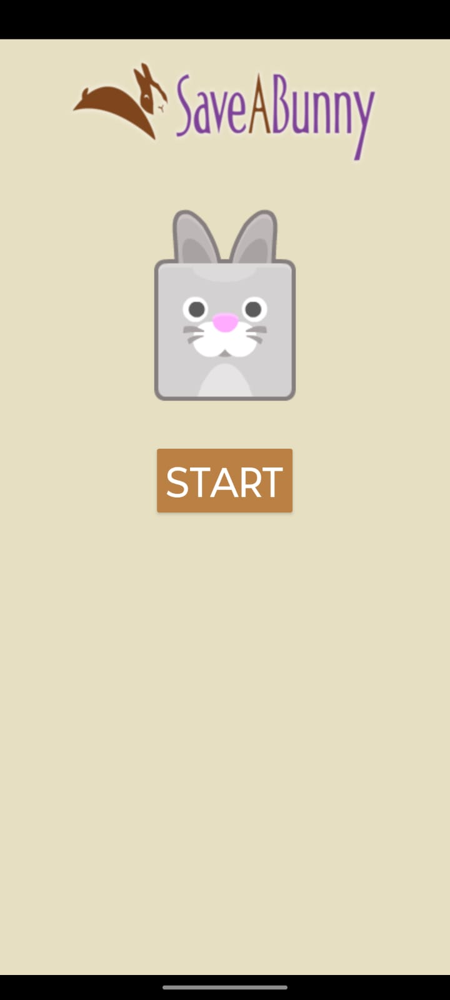
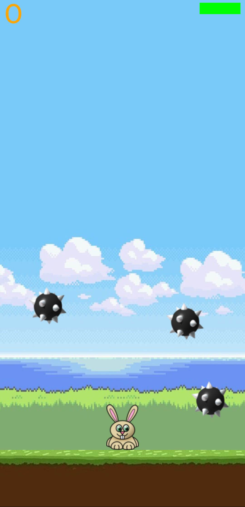
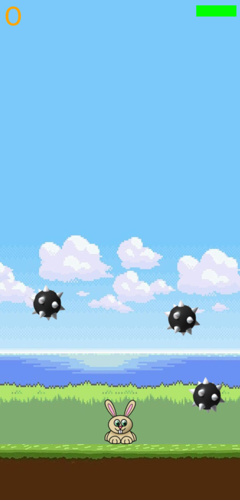
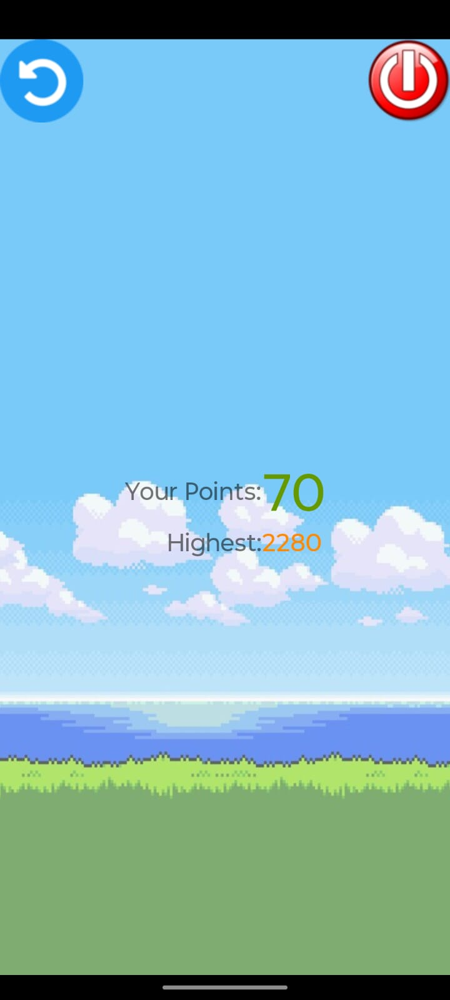

🐰 Save The Bunny – Android Micro Project

📱 Project Overview

Save The Bunny is a simple Android game application developed as a micro-project.
The main objective of the game is to protect the bunny from obstacles/enemies and help it survive as long as possible.
The project focuses on basic Android game logic, UI handling, and event-driven programming.

---

🎯 Objective

To design an interactive Android game

To understand Android UI components and layouts

To implement basic game logic and user interaction

To gain hands-on experience with Android Studio

---

🛠️ Technologies Used

Programming Language: Java

IDE: Android Studio

UI Design: XML

Platform: Android

Minimum SDK: As per project configuration
---
## Save the Bunny Game Screenshots

<table>
  <tr>
    <td></td>
    <td></td>
    
  </tr>
  <tr>
    <td></td>
    <td></td>
  </tr>
</table>

---

🎮 Game Features

Simple and user-friendly interface

Bunny character controlled by the user

Obstacles/enemies to avoid

Score tracking system

Game over screen with restart option

Smooth gameplay with basic animations

---
🚀 How to Run the Project

1. Install Android Studio

2. Clone or download this repository

3. Open the project in Android Studio

4. Connect an Android device or start an emulator

5. Click Run ▶️

6. Enjoy the game 🎉

---

📚 Learning Outcomes

Android activity lifecycle

Event handling (touch/click events)

Game logic implementation

Layout designing using XML

Debugging Android applications

---

🔮 Future Enhancements

Add multiple levels

Improve graphics and animations

Add sound effects and background music

Introduce power-ups and rewards

Online leaderboard integration

